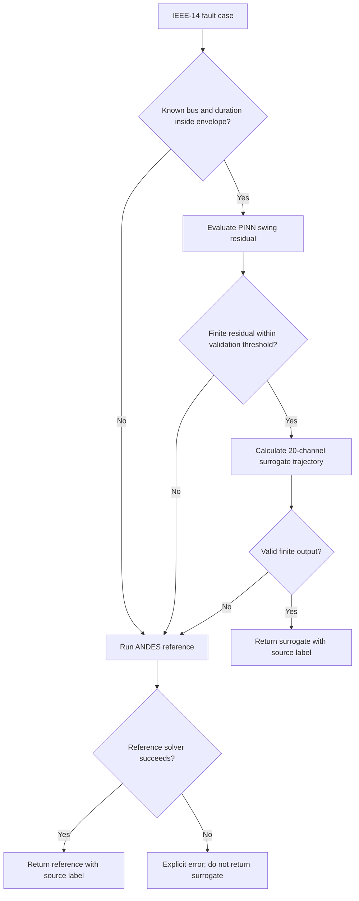

# GridGuardPINN: Trust-Aware Physics-Informed Surrogates for Power-System Transient Simulation

**Technical research report — working paper, version 1.0 (9 October 2026)**  
**Author:** Abhijith Sivaprasadan  
**Project:** [GridGuardPINN](https://github.com/abhijith-sivaprasadan/GridGuardPINN)  
**Status:** Public reproducible research demonstrator; **not peer reviewed, not submitted for publication, and not operationally certified**.

## Abstract

Neural-network surrogates can reproduce power-system transient trajectories with low inference latency, but low average prediction error does not establish when individual predictions should replace a reference simulation. GridGuardPINN investigates a deterministic trust-aware workflow for transient fault scenarios: a physics-informed neural-network (PINN) predicts electromechanical trajectories; a validation-calibrated physics-residual score and an explicit fault-parameter envelope determine whether the prediction is accepted or whether the reference simulator is executed. The study develops from a single-machine infinite-bus (SMIB) benchmark to a five-generator, 20-output surrogate of the ANDES 2.0.0 IEEE-14 dynamic test case.

A controlled three-seed ablation finds that swing-equation regularization reduces fresh in-distribution mean composite trajectory error by 11.9–19.8% relative to data-only training, but does not consistently improve duration extrapolation or the discriminative power of the residual-based gate. A pre-registered, same-dimensional network-aware location representation lowers the across-seed median unseen-location composite error from 2.9149 to 2.0539, yet its residual-only gate makes 3–4 unsafe acceptances per seed on unseen buses. This motivates a conservative router that categorically refuses untrained fault locations and out-of-envelope durations.

In a separately frozen, new-duration evaluation, the router accepts 76/84 interpolated in-envelope seed-case results with zero observed inaccurate accepts, while escalating all 21 longer-duration cases to ANDES. Finally, a three-round randomized paired wall-time benchmark of actual simulator and routed executions yields **1.568–1.954×** end-to-end speedup on a fixed 50% supported/50% duration-out-of-distribution workload across three frozen model seeds, with all seed-specific 95% bus-cluster bootstrap intervals exceeding 1.0. Results demonstrate a useful *bounded research workflow*, not a statistical safety guarantee, a validated unseen-topology surrogate, or a grid-protection system.

**Keywords:** power-system dynamics; physics-informed neural networks; surrogate modeling; transient stability; trust-aware inference; out-of-distribution detection; IEEE-14; ANDES; reference fallback.

---

## 1. Introduction

Dynamic power-system simulation is routinely used to assess transient response following disturbances. Learning-based surrogates promise inexpensive repeated trajectory evaluations for scenario analysis, optimization, and screening. A basic inference-time ratio, however, is insufficient to justify replacing a reference simulator: a surrogate may fail in important disturbance regimes, and a practical selection policy must pay for diagnostics and any necessary reference fallback.

This work examines three linked questions:

1. **Accuracy:** Does swing-equation regularization improve predictions over an otherwise matched data-only network?
2. **Generalization and trust:** Can network-informed fault-location inputs improve predictions for untrained buses, and can physics residuals safely discriminate acceptable trajectories there?
3. **Execution economics:** Under a deterministic failure-to-reference policy, does the **complete** surrogate–residual–reference workflow save time on a specified workload?

The main contribution is **not a novel physical power-system model or certified risk estimator**. It is a versioned, reproducible experimental comparison between numerical accuracy, trust decisions, and actual end-to-end cost, with the negative findings retained.

## 1.1. Related work and positioning

Physics-informed neural networks integrate supervised observations with governing-equation residuals, following the general scientific-machine-learning framework presented by **Raissi, Perdikaris and Karniadakis (2019)** [R1]. The reference solver in this project is **ANDES**, a symbolic-numeric dynamic power-system simulation framework described by **Cui, Li and Tomsovic (2021)** [R2]. A recent review by **Xu et al. (2026)** [R3] surveys the broader use of PINNs in power-system modeling, estimation and dynamics.

GridGuardPINN does **not** claim to originate these methods or establish state-of-the-art performance. Its contribution is the documented coupling of a restricted IEEE-14 electromechanical surrogate to a domain-and-residual refusal policy, together with accuracy and end-to-end fallback-cost measurements. This is a targeted literature positioning statement, not a complete systematic literature review. Details and links appear in [the source-verified bibliography](literature_context_v1_0.md).

**External references:** [R1] Raissi, M., Perdikaris, P. & Karniadakis, G. E. (2019), *Journal of Computational Physics* 378, 686–707, doi:10.1016/j.jcp.2018.10.045; [R2] Cui, H., Li, F. & Tomsovic, K. (2021), *IEEE Transactions on Power Systems* 36(2), 1373–1384, doi:10.1109/TPWRS.2020.3017019; [R3] Xu, X. et al. (2026), *Sustainable Energy, Grids and Networks*, doi:10.1016/j.segan.2026.102261.

## 2. Simulation system and experiment design

### 2.1 Reference and outputs

The main case study uses **ANDES 2.0.0**, the IEEE-14 dynamic case, five GENROU synchronous-machine models, and programmatically applied three-phase bus faults. The trained surrogate returns a 20-component time-domain vector: rotor angle `δ`, per-unit rotor speed `ω`, mechanical torque `T_m`, and electrical torque `T_e` for each of the five machines. It does **not** predict the complete network differential–algebraic state or bus voltage channels.

Reference simulations run to 2 s with a fault initiated at 1 s and cleared after a specified duration. The retained cases are those where ANDES converges; the early feasibility study separately recorded reference failures, meaning the learned evaluation domain is not the full combinatorial fault space.

### 2.2 Surrogate and training

The frozen multi-machine architecture uses five hidden layers, each with 96 tanh units, event-state and Fourier time features, a duration input and a 14-dimensional fault-location representation. It is trained on 21 fault cases: buses **3, 6, 7, 8, 9, 11, 14** at durations **0.04, 0.08, 0.12 s**. Seven validation cases use 0.06 s; fresh in-distribution (ID) evaluation uses 0.10 s; duration out-of-distribution (OOD) uses 0.14 s. A separate 21-case edge set evaluates fault locations absent from training. A one-hot fault-bus input is the baseline.

Each training case contributes 101 event-aware supervised anchor points and 56 physics collocation points. Optimization runs for 1,000 epochs with a validation-selected checkpoint. The pre-registered comparison uses fixed seeds **17, 29, 41**. The physics-informed arm adds electromechanical swing-equation residual loss at weight 0.02 after the frozen warm-up and ramp schedule; the data-only arm sets that weight to zero. Both have otherwise matched configurations.

The governing shared electromechanical residual families can be written schematically as

```text
r_δ = dδ/dt − 2π f_n (ω − 1)

r_ω = M dω/dt − (T_m − T_e − D(ω − 1))
```

with machine inertia `M`, damping `D` and nominal frequency `f_n` drawn from the trusted reference configuration. The PINN imposes **these swing equations only**; it does not enforce the full GENROU/network DAE.

### 2.3 Error and routing definitions

For every case, accuracy is measured against a solved ANDES trajectory. The frozen exploratory research screen requires maximum machine rotor-angle RMSE at most **0.05 rad** and maximum machine speed RMSE at most **0.0005 pu**. Define

```text
E = max(max_machine_angle_RMSE / 0.05 rad,
        max_machine_speed_RMSE / 0.0005 pu).
```

A case is *screen-acceptable* when `E ≤ 1`. These values are explicit **project-internal screening limits**, not grid-code or protective-relay criteria.

The physics residual is evaluated from model derivatives at collocation times excluding fault-switching discontinuities. A threshold is calibrated exclusively on validation cases. A **false accept** occurs when the router returns the surrogate for a case with `E > 1`; a **false escalation** occurs when an acceptable surrogate could have been used but the router calls ANDES.

### Figure 1. Fail-closed research execution architecture



The router's rejection conditions protect *scope*, not physical safety in a certified sense. In particular, network-aware experiments are **not** allowed to override the unseen-location rejection without a newly validated trust policy.

## 3. Experiments and results

### 3.1 Development evidence: SMIB as a controlled starting point

The initial SMIB work records negative and positive iterations under fresh held-out protocols. v0.2 had **0/16** good ID and **0/16** good OOD cases. The event-aware v0.3 reached **2/24** good fresh ID, **0/24** fresh OOD, with a residual-based combined gate accepting only **1/24** fresh ID cases. Fourier/event-aware v0.4 improved to **23/32** good fresh ID cases and combined-gate coverage **21/32**, but still produced **one fresh-ID false accept and one OOD false accept**. These findings motivated the explicit separation of trajectory accuracy from trustworthy routing and the migration to multi-machine reference experiments.

### 3.2 Physics regularization: matched three-seed ablation

The v0.2 ANDES ablation compared data-only and physics-informed training with matched splits, architecture, and optimization. Both arms achieved 7/7 satisfactory cases on validation, fresh ID, and 0.14 s duration OOD in every seed, but **0/21** on unseen fault locations in every seed. Physics regularization improved *precision*, not screen-level success on the already accurately predicted ID set.

**Table 1. Fresh-ID mean composite error, data-only versus physics-informed.**

| Seed | Data-only | Physics-informed | Relative change |
|---|---:|---:|---:|
| 17 | 0.1719 | 0.1515 | −11.9% |
| 29 | 0.1768 | 0.1477 | −16.5% |
| 41 | 0.1767 | 0.1417 | −19.8% |

Across seeds, physics training reduced residual magnitudes, but improved neither duration-OOD mean error nor residual/error rank association consistently. Median training wall time increased from **7.21 s** (data-only) to **44.55 s** (physics-informed), or **6.18×**. This is a bounded regularization benefit rather than evidence that a physics term automatically creates a reliable trust detector.

### 3.3 Network-aware fault representation: improved predictions, unsafe residual gating

The pre-registered v0.3 location-encoding experiment held input dimensionality, architecture, parameter count and seeds fixed. It replaced the 14-way one-hot bus vector with 14 base-network-only features: five generator-relative impedance-weighted shortest-path distances; five hop distances; pre-fault bus-voltage magnitude; sine and cosine of pre-fault bus angle; and active-branch degree. Held-out trajectories and residual outcomes were not inputs to descriptor construction.

**Table 2. Unseen-location results (three-seed aggregate).**

| Measure | One-hot encoding | Network-aware encoding |
|---|---:|---:|
| Median of unseen-location median composite error | 2.9149 | 2.0539 |
| Median screen-acceptable unseen-location cases, of 21 per seed | 0 | 1 |
| Seeds showing lower unseen-location median error | — | 2/3 |
| Fresh ID and duration OOD screen success | 7/7, all seeds | 7/7, all seeds |
| Unseen-location false accepts using residual-only gate | 0 median | **3–4 per seed** |

The ~**29.5%** decrease in the median-of-seed-median error is not uniform across seeds, and most held-out locations still fail. Crucially, residual-only screening falsely accepts inaccurate predictions on the network-aware arm. This is the study's central *negative trust result*: lower predictive error does not entail safer deployment decisions. A location-hard rule yields zero unseen-location false accepts by refusing all unseen locations, necessarily sacrificing unseen-location surrogate coverage.

### Figure 2. Generalization gain versus trust failure

```text
Unseen-location median composite error (lower is better)
one-hot       2.915 |█████████████████████████████|
network-aware 2.054 |█████████████████████        |

BUT: network-aware residual-only routing falsely accepts
3–4 inaccurate unseen-location cases per seed.
```

Bars are schematic representations of source-reported median-of-median values; they are not uncertainty intervals.

### 3.4 Checkpoint-pinned routed execution and new durations

A later runtime authenticates three frozen **one-hot** checkpoints using externally pinned SHA-256 digests, reconstructs the learned model with strict state loading, computes a 151-point physics residual using trusted five-machine constants, and either emits a source-labelled 20-channel surrogate result or executes ANDES. Missing or failed reference execution is surfaced as an error. The runtime intentionally rejects unseen buses and any duration outside **0.04–0.12 s**, including 0.14 s cases whose standalone surrogate predictions were previously screen-acceptable.

In the previously inspected evaluation audit, the three-seed combined execution returned **13 surrogate** and **92 reference** trajectories across 105 seed-case evaluations, with zero observed false accepts. That run demonstrates integration, not an independent blind test.

A new frozen duration-case release gate then used durations **0.05, 0.07, 0.09, 0.11 s** on seven training-location buses (28 unique interpolation conditions) plus **0.13 s** duration OOD (seven unique conditions). These values had not appeared in the original train/validation/ID/OOD case lists. All 35 distinct reference solves succeeded.

**Table 3. Pre-registered new-duration routing evaluation.**

| Seed | Interpolation cases accepted | Coverage | False accepts | New duration-OOD fallbacks |
|---|---:|---:|---:|---:|
| 17 | 24/28 | 85.7% | 0 | 7/7 |
| 29 | 27/28 | 96.4% | 0 | 7/7 |
| 41 | 25/28 | 89.3% | 0 | 7/7 |
| **Total** | **76/84** | **90.5%** | **0 observed** | **21/21** |

This establishes performance on new **duration combinations within an unchanged network**, not generalization to other systems. The same 35 physical case conditions recur across three seeds.

### 3.5 Fair end-to-end cost: randomized paired replication

Comparisons of neural forward time alone omit residual scoring and reference fallbacks. Accordingly, the final performance protocol measured *fresh ANDES-only execution* and *complete trust-aware routing* **as a paired comparison** on the same fault condition. It used three repeated rounds per seed, deterministic randomized case order and randomized execution order within pairs, plus untimed warm-up. Each round comprised seven 0.07 s in-envelope and seven 0.13 s duration-OOD conditions. In total, **126 paired seed-round-case measurements** represent **14 distinct** fault conditions, not 126 independently sampled systems.

The primary workload is precisely 50% supported / 50% duration OOD. Speedup is the ratio of **summed ANDES-only seconds to summed routed seconds**. The reported 95% percentile intervals use 5,000 paired bootstrap resamples of the **seven fault-bus clusters**, preserving rounds and both durations within each sampled bus. They characterize within-testbed bus variability on one runner, not performance across networks or hardware.

**Table 4. Randomized complete-workflow timing.**

| Seed | Accepted (of 42) | Full-route speedup | 95% bus-cluster bootstrap interval | False accepts |
|---|---:|---:|---:|---:|
| 17 | 18 | **1.755×** | 1.430–2.084× | 0 |
| 29 | 21 | **1.954×** | 1.867–2.035× | 0 |
| 41 | 15 | **1.568×** | 1.241–2.022× | 0 |

All **63** OOD seed-round-case runs escalated to ANDES; no simulator or routing failures were recorded. The mixed-workload intervals exceed 1.0 for all three seeds, with the stated limited interpretation.

### Figure 3. Full-route speedup and uncertainty, mixed workload

```text
Speedup (reference-only seconds / full-routing seconds)
                1.0×      1.5×      2.0×      2.5×
                |---------|---------|---------|
seed 17           [------●------]
                         1.755
seed 29                   [●--]
                             1.954
seed 41         [------●--------]
                          1.568
```

*Schematic only.* Exact 95% interval bounds are in Table 4; do not infer endpoints from the text spacing.

The in-envelope-only route accelerated by **3.476× to 81.249×** across seeds, but in-envelope uncertainty is extremely wide for two seeds because bus-cluster bootstrap samples differ in how many cases require expensive fallback. OOD-only speedup was **1.008–1.018×**, with all three OOD-only bootstrap intervals crossing 1.0. There is therefore **no demonstrated OOD-only performance benefit**. An earlier single-pass benchmark reported **1.99–2.95×** on the same mixture; the repeated randomized analysis is the preferred, more conservative estimate.

## 4. Discussion

### 4.1 What physics does and does not buy

A swing-residual loss improves trained-location trajectory precision under the tested protocol, but neither assures transfer to an unseen input category nor guarantees residual/error discrimination under disturbance shift. A sufficiently low residual is not proof that the full network differential–algebraic system is satisfied. The network-aware model result sharply demonstrates this: a representation that improves some unseen-location predictions can simultaneously worsen unsafe acceptance under a fixed residual-only gate.

### 4.2 Trustworthy refusal has a measurable cost

Hard-coded domain refusal makes unseen-bus and duration-out-of-envelope behavior predictable: the system cannot accidentally accept them. That statement is about the **implemented policy**, not a probabilistic guarantee about supported inputs. Conservative rejection also incurs real simulator cost. The workload-mix dependence of total speedup is therefore not a nuisance; it is central to deployment economics. The reported acceleration applies to a specified balanced mixture and cannot be generalized to grids with different fallback frequencies.

### 4.3 Scientific uncertainty

Three model seeds provide useful evidence of training sensitivity but cannot quantify population-wide error rates. The same 14 fault conditions are repeated in the timing experiment, and the bootstrap resamples just seven buses. No confidence interval in this report estimates the probability of unsafe acceptance on unseen operating points. Further evidence would require independent network cases, operating-point changes, protection-relevant contingency classes, broader fault types, cross-platform timing, and a prospective calibration and testing design that avoids revisiting inspected holdouts.

### 4.4 Engineering reproducibility versus external validity

The model artifact and workflow runs are reproducibility aids: checkpoint integrity is protected by SHA-256, and the execution code records routing source and error. GitHub Actions artifacts have finite retention; publication-grade archiving with immutable permanent artifacts remains necessary. The research demonstrator does not provide voltage dynamics from the learned model, production monitoring, industrial solver qualification, or a power-system safety case.

## 5. Limitations and threats to validity

1. **Single network and simulator:** IEEE-14 and ANDES 2.0.0 only. No cross-topology experiment of the complete conservative runtime.
2. **Incomplete physical enforcement:** electromechanical swing residuals, not the full network DAE.
3. **Partial surrogate outputs:** 20 machine channels; no learned bus voltages or full transient-stability assessment.
4. **Small and selected scenario sets:** 7 trained buses, 21 unseen-location edge cases, and source-reference feasibility limitations.
5. **Limited blind testing:** v0.3's inspected cases cannot be reused as fresh evaluation; later new-duration cases provide only within-grid interpolation evidence.
6. **Conservative hard boundary:** all unseen buses and unsupported fault durations escalate, even when a model's trajectory might have been accurate.
7. **No safety guarantee:** zero *observed* false accepts is not a calibrated tail-risk estimate.
8. **Hardware dependence:** measured Python/ANDES startup, CPU contention and solver costs depend on CI environment. Bootstrap intervals do not capture cross-host variation.
9. **No production validation:** no real-grid measurements, hardware-in-the-loop studies, protection tests, regulatory acceptance, or operational deployment.

## 6. Conclusion

GridGuardPINN shows that research-credible surrogate acceleration requires **joint evaluation of prediction error, trust decisions and full execution cost**. Physics-informed training improves in-distribution accuracy in matched IEEE-14 ablations; network-aware fault encoding partially improves unseen-location error but exposes unsafe residual-only acceptance; strict domain rejection prevents those unseen-location accepts at the cost of zero learned coverage there. Within the narrowly specified IEEE-14 case family, frozen-checkpoint routing achieves 90.5% acceptance of new intermediate-duration cases with zero observed false accepts, while a repeated randomized paired benchmark records **1.57–1.95× complete-workflow acceleration** on a 50/50 supported/OOD workload. These findings justify a transparent **research demonstrator**. They do not justify claims of certified safety, general unseen-grid performance or industrial-grade speedup.

## 7. Reproducibility, frozen sources and data availability

All statements above are grounded in project-specific frozen reports and GitHub Actions evidence. This working paper does **not** assert an external literature review, novelty priority, peer-review status or acceptance by a journal.

| Evidence source | Immutable run / source |
|---|---|
| SMIB v0.2–v0.4 experiments | [Repository README](../README.md) and `docs/results_v0_2_baseline.md`, `docs/results_v0_3.md`, `docs/results_v0_4.md` |
| ANDES v0.1 initial experiment | [Run 37899938971](https://github.com/abhijith-sivaprasadan/GridGuardPINN/actions/runs/37899938971); [frozen report](results_andes_surrogate_v0_1.md) |
| Physics ablation v0.2 | [Run 37912584795](https://github.com/abhijith-sivaprasadan/GridGuardPINN/actions/runs/37912584795); [frozen report](results_andes_surrogate_ablation_v0_2.md) |
| Fault encoding v0.3 | [Run 37922112172](https://github.com/abhijith-sivaprasadan/GridGuardPINN/actions/runs/37922112172); [frozen report](results_andes_location_encoding_v0_3.md) |
| Frozen-checkpoint integration | [Run 37924679301](https://github.com/abhijith-sivaprasadan/GridGuardPINN/actions/runs/37924679301); [report](results_andes_trained_runtime_v1_candidate.md) |
| New-duration release gate | [Run 37925430499](https://github.com/abhijith-sivaprasadan/GridGuardPINN/actions/runs/37925430499); [protocol](andes_v1_fresh_duration_protocol.md); [report](results_andes_v1_fresh_duration.md) |
| Single-pass full timing | [Run 37928033388](https://github.com/abhijith-sivaprasadan/GridGuardPINN/actions/runs/37928033388); [report](results_andes_v1_performance.md) |
| Repeated randomized timing | [Run 37939032862](https://github.com/abhijith-sivaprasadan/GridGuardPINN/actions/runs/37939032862); [protocol](andes_v1_randomized_performance_protocol.md); [report](results_andes_v1_randomized_performance.md) |
| Training/checkpoint source | [Original v0.3 archive](https://github.com/abhijith-sivaprasadan/GridGuardPINN/actions/runs/37922112172), SHA-256 manifest in `scripts/run_andes_trained_runtime_audit.py` |
| Runtime and benchmark implementations | `src/gridguardpinn/andes_runtime.py`; `scripts/run_andes_v1_randomized_performance.py` |

**Citation suggestion (software/report, not a peer-reviewed publication):** Sivaprasadan, A. (2026). *GridGuardPINN: Trust-Aware Physics-Informed Surrogates for Power-System Transient Simulation*. Technical working paper, GridGuardPINN GitHub repository. Cite a commit SHA and permanent archived numerical artifacts once a formal release is published.

## 8. Next research directions

The most informative next experiment is not to optimize the present test cases again. Pre-register a new dataset of operating-point shifts and faults on **another dynamic power-system network**, and jointly evaluate (i) calibration and coverage under that shift, (ii) unsafe acceptance rate among predictions actually returned by the surrogate, and (iii) end-to-end cost, including reference failures and fallbacks. Compare an explicit location-hard baseline with any proposed transfer-aware gate **without selecting on the holdout outcomes**. For subsequent publication, supplement this report with external academic literature, precise versioned software dependencies, a permanent data archive and journal-appropriate figures.
